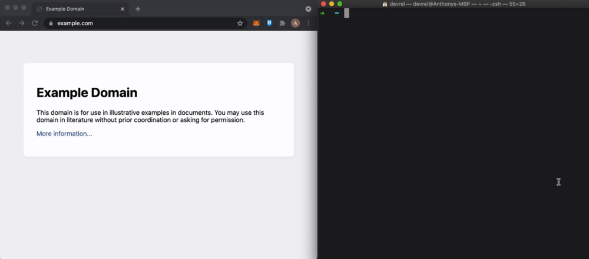
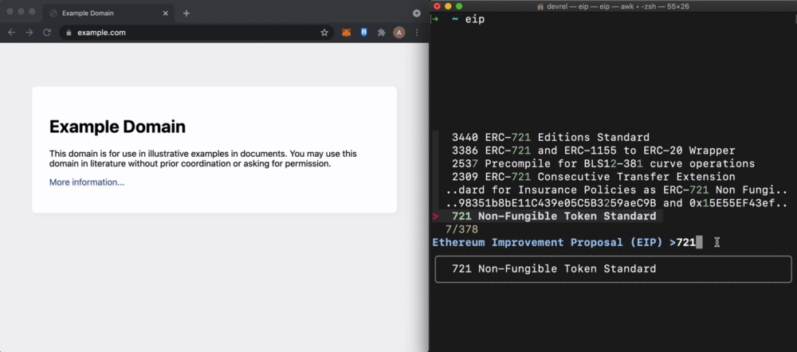

# EIP Fuzzy finder launch thing

[fzf](https://github.com/junegunn/fzf) helper to search EIPs by number or name.
Selecting it will open the EIP in your browser. [See this
demo](https://www.youtube.com/watch?v=2VOZV9tsmGs)

## Search 🔍



## Launch 🚀



# Installation

1. Install [fzf](https://github.com/junegunn/fzf), a general-purpose
   command-line fuzzy finder.

1. Clone this repo
   ```sh
   git clone https://github.com/cds-amal/fzf-eip.git ~/.fzf-eip
   ```
1. Edit your .bashrc or .zshrc startup script file. If you don't know, enter
   `ps -p $$` to know your currently running shell. Modify `~/.bashrc` for bash
   and `~/.zshrc` for zsh.

   ```sh
   # somewhere in your .bashrc or .zshrc file...

   # FZF_EIP_HOME is the directory where you cloned to
   export FZF_EIP_HOME=$HOME/.fzf-eip
   source $FZF_EIP_HOME/init.sh
   ```

## A note on browser configuration

For non WSL linux and Mac OS X, this script relies on `xdg-open`. You can
[configure](./init.sh) this to a different browser if `xdg-open` is not viable for your
setup.

For WSL2, it relies on the fullpath to the browser executable. You can change
the default to use the browser of your choice in [init.sh](./init.sh) for more
details.

## Supported Operating Systems

| Operating System   | Support Status |
| ------------------ | -------------- |
| Ubuntu             | 🟢             |
| Debian             | 🟢             |
| MacOS              | 🟢             |
| WSL 2 (Windows 10) | 🟢             |
| WSL 2 (Windows 11) | 🟢             |
| FreeBSD            | 🤷‍♂️             |
